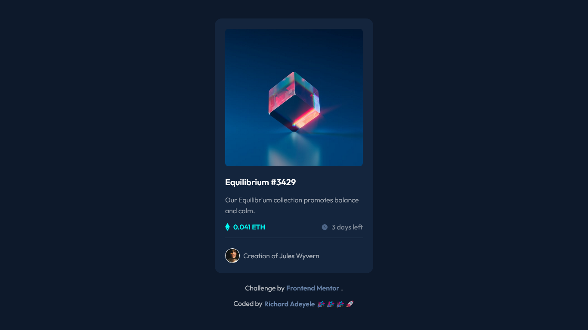

# Frontend Mentor - NFT preview card component

This is a solution to the [NFT preview card component on Frontend Mentor](https://www.frontendmentor.io/challenges/four-card-feature-section-weK1eFYK/hub). Frontend Mentor challenges help you improve your coding skills by building realistic projects.

## Table of contents

- [Overview](#overview)
  - [Screenshot](#screenshot)
  - [Links](#links)
- [My process](#my-process)
  - [Built with](#built-with)
  - [What I learned](#what-i-learned)
- [Author](#author)

## Overview

### Screenshot



### Links

- Solution URL: [QR Code Challenge](https://github.com/Richlee-demo/nftpc/blob/main/index.html)
- Live URL: [QR Code Challenge](https://richlee-demo.github.io/nftpc/)

## My process

### Built with

- HTML
- CSS

### What I learned

During this particular challenge, I encountered several new and unfamiliar obstacles. However, I was able to overcome them. I relied heavily on resources such as Google, Stack Overflow, and W3Schools, especially when implementing the card hover effect that changes content when the mouse is over it. Furthermore, I am proud to have made the design fully responsive and optimized for all mobile devices. Overall, this challenge was a great achievement for me, as it tested my problem-solving skills and allowed me to learn and grow as a developer. I am excited to take on more challenges in the future and continue honing my craft.

```html
<h1>Some CSS code I'm proud of</h1>
```

```css
.overlay {
  position: absolute;
  top: 0;
  bottom: 0;
  left: 0;
  right: 0;
  height: 100%;
  width: 100%;
  border-radius: 0.5rem;
  opacity: 0;
  transition: 0.5s ease;
}
```

```css
#overlay {
  position: absolute;
  top: 50%;
  left: 50%;
  -webkit-transform: translate(-50%, -50%);
  -ms-transform: translate(-50%, -50%);
  transform: translate(-50%, -50%);
  text-align: center;
}
```
## Author

- Website - [Richard Adeyele](https://app.uxcel.com/ux/LMA2N5TROOXQ)
- Frontend Mentor - [@Richlee-demo](https://www.frontendmentor.io/profile/Richlee-demo)
- Twitter - [@JCRichLee](https://www.twitter.com/JCRichLee)
